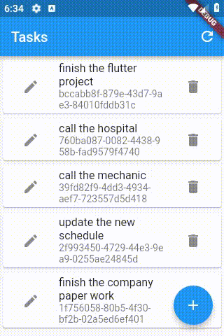

# e014_flutter_animatedlist_noanimation_e004base

## Based On e004

- [elrashid-flutter-examples/e004_flutter_listview_crud_app_using_nonsecure_rest_api](https://github.com/elrashid-flutter-examples/e004_flutter_listview_crud_app_using_nonsecure_rest_api)

## Screen Record

## What

- animatedlist for tasks in flutter Task app (e004)

- no animation used

- demonstrate the use of :

  - myListKey.currentState.removeItem

  - myListKey.currentState.insertItem

- must run with :

  - [elrashid-flutter-examples/e002-aspcore-rest-api-server-for-flutter](https://github.com/elrashid-flutter-examples/e002-aspcore-rest-api-server-for-flutter)

## Step 1

    final _myListKey = GlobalKey<AnimatedListState>();

## Step 2

         // get
        var newTasks = await Tasks.allTasks();

        // Delete
        var newTasksGuids = newTasks.map((m) => m.guid);
        var taskstoRemove =
            tasks.where((old) => !newTasksGuids.contains(old.guid)).toList();
        for (var i = 0; i < taskstoRemove.length; i++) {
        var ti = tasks.indexOf(taskstoRemove[i]);
        var removedItem = tasks.removeAt(ti);
        _myListKey.currentState.removeItem(
            ti,
            (BuildContext context, Animation<double> animation) =>
                TaskWidget(taskOpj: removedItem, notifyParent: null));
        }

        // insert and update
        for (var i = 0; i < newTasks.length; i++) {
        var t = tasks.singleWhere((w) => w.guid == newTasks[i].guid,
            orElse: () => null);
        if (t == null) {
            tasks.insert(0, newTasks[i]);
            _myListKey.currentState.insertItem(0);
        } else {
            if (t.modfiledAt != newTasks[i].modfiledAt) {
            var ti = tasks.indexOf(t);
            tasks[ti] = newTasks[i];
            }
        }
        }

## Step 3

    AnimatedList(
        key: _myListKey,
        initialItemCount: tasks.length,
        itemBuilder: (context, index, animation) => TaskWidget(
        taskOpj: tasks[index],
        notifyParent: refresh,
        ),
    ),

## Full code

    class _TasksPageWidgetState extends State<TasksPageWidget> {
    final _myListKey = GlobalKey<AnimatedListState>();

    @override
    void initState() {
        super.initState();

        refresh();
    }

    Future refresh() async {
        var newTasks = await Tasks.allTasks();

        // Delete

        var newTasksGuids = newTasks.map((m) => m.guid);

        var taskstoRemove =
            tasks.where((old) => !newTasksGuids.contains(old.guid)).toList();

        for (var i = 0; i < taskstoRemove.length; i++) {
        var ti = tasks.indexOf(taskstoRemove[i]);
        var removedItem = tasks.removeAt(ti);
        _myListKey.currentState.removeItem(
            ti,
            (BuildContext context, Animation<double> animation) =>
                TaskWidget(taskOpj: removedItem, notifyParent: null));
        }
        // insert and update
        for (var i = 0; i < newTasks.length; i++) {
        var t = tasks.singleWhere((w) => w.guid == newTasks[i].guid,
            orElse: () => null);
        if (t == null) {
            tasks.insert(0, newTasks[i]);
            _myListKey.currentState.insertItem(0);
        } else {
            if (t.modfiledAt != newTasks[i].modfiledAt) {
            var ti = tasks.indexOf(t);
            tasks[ti] = newTasks[i];
            }
        }
        }
    }

    var tasks = List<TaskOpj>();

    @override
    Widget build(BuildContext context) {
        return Scaffold(
        appBar: AppBar(
            title: Text("Tasks"),
            actions: <Widget>[
            IconButton(
                icon: Icon(Icons.refresh),
                onPressed: () => refresh(),
            ),
            ],
        ),
        body: AnimatedList(
            key: _myListKey,
            initialItemCount: tasks.length,
            itemBuilder: (context, index, animation) => TaskWidget(
            taskOpj: tasks[index],
            notifyParent: refresh,
            ),
        ),
        floatingActionButton: FloatingActionButton(
            onPressed: () => Navigator.push(
            context,
            MaterialPageRoute(
                builder: (context) {
                return TaskAddPageWidget(
                    notifyParent: refresh,
                );
                },
            ),
            ),
            tooltip: 'add',
            child: Icon(Icons.add),
        ),
        );
    }
    }

## Ref

[AnimatedList - Flutter](https://flutter.dev/docs/catalog/samples/animated-list)

[Flutter AnimatedList example - knowledge Transfer](https://androidkt.com/flutter-listview-animation/)

[Flutter - AnimatedList Example - Woolha](https://www.woolha.com/tutorials/flutter-animatedlist-example)

[AnimatedList (Flutter Widget of the Week) - YouTube](https://www.youtube.com/watch?time_continue=75&v=ZtfItHwFlZ8)

[Flutter - Animations in Flutter - easy guide - tutorial](https://www.didierboelens.com/2018/06/animations-in-flutter---easy-guide---tutorial/)
